# Persistent Data Structures and Managed References

* **Speaker: Rich Hickey**
* **Conference: [QCon]() - Oct 2009**
* **Video: [http://www.infoq.com/presentations/Value-Identity-State-Rich-Hickey](http://www.infoq.com/presentations/Value-Identity-State-Rich-Hickey)**

[Time 0:00:00]

How many people program in a functional programming language?  OK, so
halfway preaching to the converted.  And not in a functional
programming language?  A non-functional programming language?  So
still a lot of that.

I think this will be useful to both audiences.  In particular if you
are not in a functional programming language, in fact if you are not
in Erlang, which I think has a complete story for how they do state,
all the other functional programming languages have two aspects.  They
have this functional part, and then ... and then.

Haskell has this beautiful side where the type system keeps this part
pure.  And then there is the other part which is kind of imperative:
do this, do that.  And then they have a bunch of constructs to provide
facilities for when you need state on that side.

Similarly there are a lot of "hybrid" functional languages, like Scala
and F#, where I think there are questions to be asked about: OK here
is the pure part, what is the story about the other part?

[Time 0:01:13]

So what I want to do today is to talk about functions and processes,
and to distinguish the two.  In fact, the core concept in this talk is
to try to parse out what we mean by identity, state, and values; try
to separate those concepts.  And see how programming with values,
while a really important part of the functional part of your program,
ends up being a critical part of the non-functional part of your
program, the part that actually has to manage state and behave as if
things are changing.

And there are two components to that.  One is: how do you represent
composite objects as values?  A lot of people who are new to
functional programming wonder about the efficiency and representation
issues there, and I will talk about that.  And finally I will talk
about one approach to dealing with state and change in a program, the
one that Clojure uses, which is compatible with a little bit of
philosophy that I am going to start with.

[Time 0:02:11]

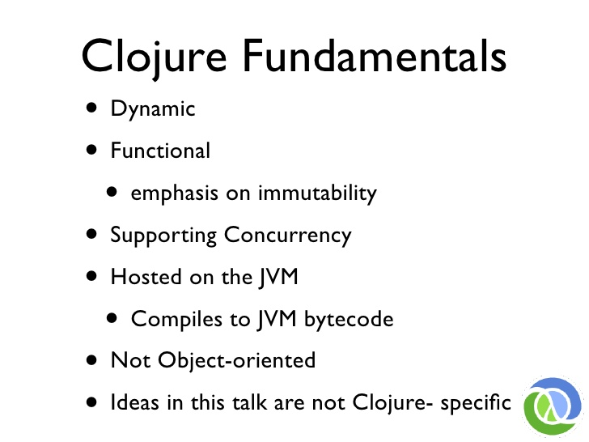

I am not really going to talk about Clojure very much.  How many
people were at my talk yesterday?  OK, how many people who were not
know something about Clojure?  OK.  This is not really a Clojure
specific talk.  There will be some code later.  It should not be too
threatening.  I am just going to summarize quickly with this one slide
what Clojure is about.

It is a dynamic programming language.  It is dynamically typed.  It is
functional.  In particular, it is functional in emphasizing
immutability, not just in supporting higher order functions.  All the
data types in Clojure are immutable.

It supports concurrency.  It is a two part story.  One is: you have to
have good support for immutability and pure functions.  The other part
is: you have to have a story for when multiple things are happening at
a time and you are going to have some perceptible change, and Clojure
does.  In fact, I think it is an important part of a language that
purports to be functional to have a story about the non-functional
parts.

Clojure is not particularly object oriented.  It may be clear after
listening to this talk why not, because I think as currently
implemented, a lot of object technologies have big problems when they
face concurrency and functional programming.  And as I said, from a
conceptual standpoint, nothing about this is really Clojure specific.

[Time 0:03:32]

So what do we mean by functions?  I think that there is a really easy
way to say, "Oh, a function is something that you call", and that is
_not_ what we are talking about here.  We are talking about a very
precise notion of a function, which is something that you call that
takes values as arguments and produces a value as a return.  When it
is given the same arguments, it always produces the same value.

It does not depend on the outside world.  It does not affect the rest
of the world.  So many methods in your classes are not functions by
this definition, but in particular too, I want to highlight the fact
that function, pure functions, have no notion of time.  Time is going
to be a critical notion through this talk.

[Time 0:04:12]

So what is functional programming?  There are lots of answers to this
question, and I think people who are into type systems will claim a
stronger argument for what constitutes functional programming.  But I
am going to limit the definition here to programming that emphasizes
programming with functions.  So you want to try to write as much of
your program as you can with pure functions.  When you do that you get
a ton of benefits.  They have been talked about in other talks.  It is
not really the focus of this talk other than to say, even without
concurrency, your program will be easier to understand, easier to
reason about, easier to test, more modular, and so forth.  That all
falls out of programming with functions to as great an extent as
possible.

On the other hand, when you step back and look at your entire program,
very few programs, on the whole, are functions.  You know, that take a
single input, think about it, and produce a single output.  Maybe some
compilers or theorem provers work that way, but most real world
programs that I have worked on, and I think most real world programs
in the real world do not work that way.

In particular, even if you claimed your program was completely
functional, if it is going to produce any output, it is not, because
otherwise it will just warm up the machine.  But even if it is mostly
functional, there are still observable effects of a purely functional
program running.  It is running on a computer.  As soon as it is
running on a computer it is not math any more.  It is a program
running on a computer.  It is consuming memory.  It is consuming clock
cycles.  It is observably doing something over time.  So _all_
programs do things over time.

But most real programs, as I say, actually have observable behavior
that is not just the fact that they are running on a computer, but
that they are doing things.  They are interacting with the outside
world.  They are talking over sockets.  They are putting stuff on the
screen.  They are putting things in or out of the database.

In particular though, we will use one critical measure about how to
define state, which is: if you ask the same question twice, and you
get different answers, then there is state.  I do not care where you
put it.  You can put it in a process, you put it in an agent, an atom,
in a variable.  It does not matter, in a database.  If you ask the
same question twice and get different answers at different times, you
have state.  So again, the word "time" just came up again there.

[Time 0:06:37]

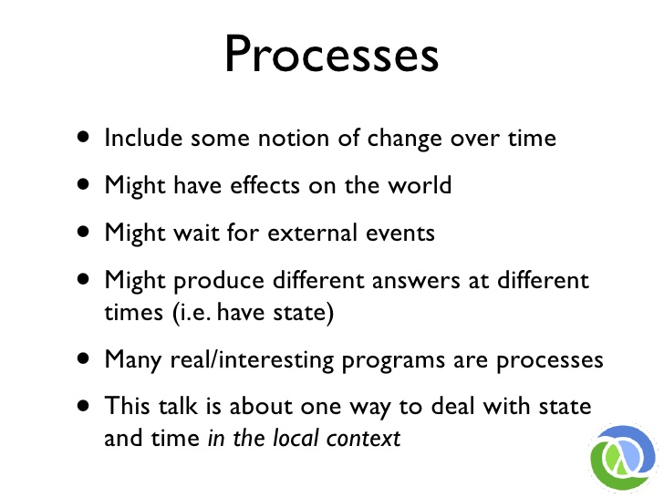

So I think most programs are processes, which means we need to talk
about the part of your program that cannot be purely functional, the
part that is going to have to produce a different answer at different
times.  How do you do that, and not make a complete mess out of what
you created with the shiny pure part?

In particular, though, I want to highlight the fact that this talk is
strictly about the notion of state and time in a local context.  I am
talking about in the same process.  There are a completely different
set of requirements and characteristics of distributed programs, where
you cannot do the same things that you can do in the same process.  So
I am talking _only_ about same-process concurrency and state.

[Time 0:07:35]

So I want to be a little bit more precise about what I mean when I say
identity, state, and value, and these kinds of things.  And in
particular I want to talk about state and I will talk about it twice.
One is just sort of a generic statement: state is the value of an
identity at a time.

Maybe none of that makes sense.  Maybe it sounds like a variable from
a traditional programming language.  Because I think if you ask
somebody who is using a traditional programming language, "Do you have
state?"  They will be like, "Yeah I have some variables, and I change
them".  And that is not a good sound definition of what constitutes
state.

So are variables state?  Do they do this job?  Do they manage the
value of an identity over time?  We can have a variable i, we can set
it to zero, we can set it to 42, we can assign one variable to
another.  Is j 42?  That depends.  In a sequential program, probably,
kinda, sorta.

In a program that had threads, what could go wrong?  Well I did not
say what order these things happened in, or what threads they happened
in.  For instances if you set j equals i in a separate thread, what
bad thing could have happened to you?  Would it say 42 necessarily?
No, definitely not.  Because that memory may not have been flushed
through to the other thread's cache.  It is not volatile, necessarily,
"i".

What else could happen that is bad?  Maybe i is a long, maybe setting
a long is not atomic in your programming language.  Bad.

[Time 0:09:05]

So variables are not going to be good enough to do the job of managing
state.  They are predicated on a single thread of control.  They
actually do not work at all, otherwise.  They are horribly broken by
concurrency.  The whole notion of, "there is this piece of memory",
does not work.  And our programs are built substantially on this,
whether it is a variable sitting on the stack, or fields in your
object, same problems.  Pieces of memory are insufficient
abstractions.

So we have the problem of non-atomicity of long writes.  That is a
problem in a lot of languages, that it is just not atomic.  So you
could get half of a number if you look at it from another thread.
Write visibility and memory fences have to be accounted for once you
have multiple threads of control on a true concurrent box.

If you have an object, and it has a bunch of these things collected
together that constitute its state, now you have the problem of
composing a composite operation.  Because making it into another valid
state requires touching several of these variable things, which now
makes you impose locks or some sort of synchronization that say, "Stay
away from me, so I can pretend there is only one thread of control,
because that is what my language thought when they wrote it", or the
language they copied thought when they wrote _it_.

All of these things are examples of the same problem.  We are having
to work around the lack of a model for time.  Because there is no
point to having variables if you do not have time.  And just think
about that for a second.  If there is no time notion, why would you
need a variable?  If you cannot go back to it later and see something
different, how is it a variable?

[Time 0:10:47]

So if we want to be clearer about time, which we are not going to be
in a non-physics lecture.  We are just going to say, "What are some
things you think of when you think of time?"  You think of things
being before or after other things.  You think of something happening
later.  You think of something happening at the same time, two things
happening at the same time.  You think of something happening right
now, which is sort of a self-relative perspective of time.

But all of these concepts are important in that they are _inherently_
relative.  When you think about time, there is not a lot about time
that are hours, or this particular moment with a name on it.  Most of
our notions of time have to do with relative time, the ordering
between two discrete things.

[Time 0:11:36]

What do we mean by values?  Again, here is an area where there is just
so much ambiguity and loose thinking, that we cannot write correct
program until we sort of nail this down.

So the core characteristic of a value is that it is immutable.  Some
values are obvious.  Numbers.  We all are comfortable with that
concept that it is a value.  But I will contend that until you start
thinking about composites of these things, like numbers, as values,
you are doomed in the future.  You may not be doomed right now, but at
some point it is going to be a problem for your programs.

So what went wrong?  We all think 42 is indivisible.  Of course we saw
that if we store it in a long, it may not be, depending on our
language.  But the idea of 42 we consider to be an atomic concept.

But we have a _big_ problem in the way we think about composite
objects.  Some of that falls out of our languages I think.  They have
date libraries where you can set the month is a crazy concept.  There
is this date and there is that date.  There is not setting the month
of a date, and it is another date.  Right away you have that problem:
I set the month of a date and it is another date.  If it is another
date, you have two dates.  You do not have one settable date.  And our
class libraries have destroyed our brains in this area.

Also the default behavior of our languages: you create a new class in
most languages and everything is variable.  And instantly you have
this stateful mess that maybe you have to clean up with a lot of
discipline on your part.  So I am going to contend that dates, sets,
maps, everything is a value, and should be treated like a value.  And
you should separate your concept of value from your concept of change.

[Time 0:13:24]

So one more concept in the philosophy portion of the talk, which is
the concept of identity.  This is probably the most nebulous of these
things, but it is an important thing.

What happens in the real world?  What happens in the real world when
we talk about today, or mom, or Joe Amstrong?  Is that a single
unchanging thing?  Or one way to think about it is: we have a logical
entity, that we associate with different values over time.  In other
words, at any particular moment, everything is frozen.  And the next
moment we look, we see something different.  Is that the same thing?
Well, if some force has acted on this thing to produce that next
thing, I consider it to be the same thing.  Otherwise, they are
unrelated things.  Two things can pass through the same space.  They
are not the same thing because they are in the same space.

So a set of values over time, where the values are causally related,
is something we need to name.  These are different values.  They may
be in different spaces.  I can walk over here.  I am still Rich.  So
what is happening?

What is happening is easy to understand if you have three notions.
There is a state: I am standing right here.  [moves a step sideways]
There is a state: I am standing over here.  They are both values.  If
you could stop time for a second, nothing about me would be changing.
And it is me, because I am using my legs to move myself over here, and
I am still talking, and you see a set of causal connections between me
being here and being there.  So you say: that is all Rich.  That is
not two people doing this.

Identities are not the same things as names.  I just want to make that
clear.  I have a mother.  You now have that concept in your head, this
identity.  But I call her mom, and you would call here Mrs. Hickey, I
hope.

These identities can be composite.  We can talk about the New York
Yankees, or Americans, no problem.  Those are sets, but they are also
identities.  They change over time, but at any particular point in
time they have a value.  These are the guys who are on the Yankees
right now.  Any program that is a process needs to have some mechanism
for identity.  This all goes together.

[Time 0:15:52]

So I will go back and talk about state.  We have some terms that
hopefully mean something.  Now we can say: a state is a value of an
identity at a time.  Hopefully that makes sense.  The identity is a
logical thing, it is not necessarily a place, it is not a piece of
memory.  A value is something that never changes.  And time is
something that is relative.

Now it is easy to see, I think, why we cannot use variables for state.
In particular, that variable may not refer to something that is
immutable, so already [makes buzzer sound] that is a problem.  If you
make a variable refer to a variable, you are building on sand.  The
key concept is: variable -- or whatever we are going to do to manage
time -- has got to refer to values.

Sets of variables, as we traditionally have them, can never constitute
a value, because they are not atomically composite.  Because we are
saying a value is something that is immutable.  If you can change the
parts independently, then it is not immutable, because there is going
to be a moment when one part is halfway there and another part is not
there.  That is not a valid value now.  Something is happening in the
middle.

And more globally you can say about variables, their problem is they
have no state transition management.  That is the management of time,
a coordination model for time.  How do you go from: I am in this
state, now I am in that state, both states being immutable values.

[Time 0:17:20]

So this is the summary of the philosophy portion.  A key concept I
think is: things do not change in place.  We think that they do, but
they do not.  The way you can see that this is the case is to
incorporate time as a dimension.  Once time is a dimension, once you
have x, y, z, time, guess what?  That is over here.  If something is
happening here, this is no different.  Things do not change in place.
Time proceeds.  Functions of the past create the future.  But both
things are values.

There are a couple of aspects, I think, to the design of the things I
am going to show you that I think are important when you try to model
time in the local context.  These are things I do not want to give up.
These are things I know I can achieve by brute force in Java, and I
cannot sell my language if I cannot achieve them in Clojure, for
instance.  Which is: co-located entities can see each other without
cooperation.  There are a lot of messaging models that require
cooperation.  If I want to see what you are about, I have to ask you a
question.  You have to be ready to be asked that question.  You have
to be willing to answer my question.

But that is not really the way things are when you are co-located.  I
do not know what is happening in the next building, but I can see all
of you, and I can certainly look at the back of your head without
asking you permission.

The other thing that I think is really important in a local context --
it really should be written off as impossible in a distributed context
-- is: you can do things in a coordinated manner with co-located
entities in the same process.  You can say: let us all work together,
and do this all right now.  As soon as you are distributed, you cannot
do that.  So the models I am going to show you support visibility of
co-located entities and coordination.

[Time 0:19:15]

So let us take a little example.  A little race-walker foul detector.
Race walkers, they have to walk, they cannot run.  They have to walk
step step step, heel toe, and they cannot have both feet off the
ground at the same time.  That is a foul, and then you get kicked out
of the race.

So how do we do this?  Well we go and we get the left foot position,
and we see it is off the ground.  We go and we get the right foot
position and we say: oh, it is off the ground.  So they are running,
right?

It sounds funny, but everybody writes programs that do exactly this
all the time, _exactly_ this.  And you wonder: why didn't it work?  We
cannot work that way.  We cannot have time and values all munged
together where things are changing while we are trying to look at
them.  That does not work.  We cannot make decisions.  We do not make
decisions as human beings this way.

[Time 0:20:09]

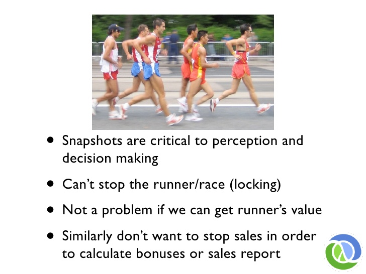

Snapshots, and the ability to consider something as a value at a point
in time, are _critical_ to perception and decision making.  And they
are as critical in programs as they are to us as human beings.  If you
look at our sensory systems, they are completely oriented on creating
momentary glimpses of a world that we would otherwise just perceive to
be completely fungible.

Now how do we achieve this, programmatically?  Well one of the things
I think we have to advocate if we want to write programs that can work
on multiple cores, and benefit from being on multiple cores, is: we
cannot stop the race.  We cannot stop the runner.  We cannot say,
"Whoa!  Could you just hang on a second, because I just want to see if
you are running."

Also we cannot expect the runner to cooperate.  Could you just tell me
if you are running?  But if we could consider the runner to be a
value, like this guy on the right here, it is kind of nice that we can
look at him as if he was a value.  There is a point in time that was
captured by this photograph, right?  It is a single value.  I do not
have to independently look at the left and right while _time
proceeds_.  I have got a value in hand.  It was captured at a point in
time.  The race kept going, but I can see that guy has got a foul on
the right.  He has got both his feet off the ground.  That is easy.

That is the kind of easiness you want to have in the logic of your
applications.  You want to be working with values.  You do not want to
be working with things that are running away from you as you are
trying to examine them.

So it is not a problem to do this work if we can get the runner's
value.  In a similar way, we do not want to stop people from
conducting sales so we can give them bonuses or do sales reports.  We
need to move to a world in which time can proceed _and_ we can do our
logic, and we do not need to _stop everybody_ so we can do our logic.
The two things have to be independent.

[Time 0:22:00]

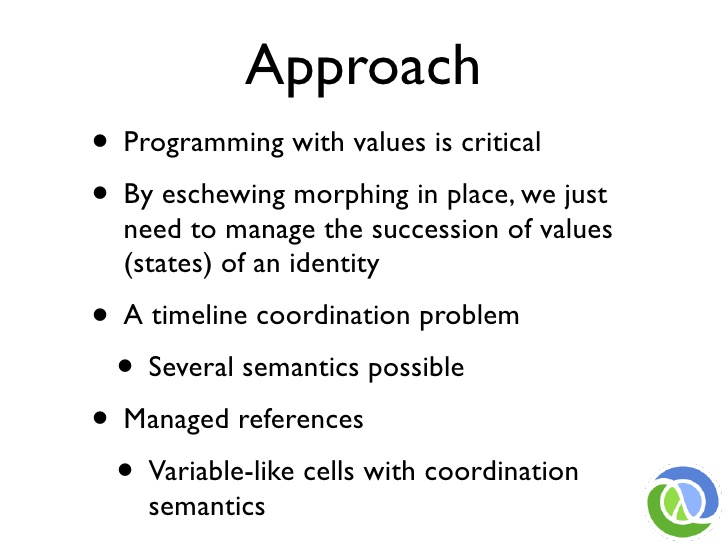

So, how does it work?  Well, the first thing is: we have to program
with values.  We have to use values to represent not just numbers, and
even small things like dates, but pretty much everything: collections,
sets.  Things that you would have modeled as classes should be values.

I am not saying there could not be an object-oriented system that
worked this way.  I do not know of one that does.  But you should
start looking at your entire object as if it was a value.  It should
never be in pieces that you could twiddle independently.  You want a
new state of that object, you make an entire new value.

So then, what is the problem with time?  It becomes a much smaller
problem.  All we need to do is get some language constructs, or some
way, to manage the succession of values.  An identity is going to take
on a succession of values over time.  We just need a way to model
that.  Because we have pure functions, we know how to create new
values from old values.  We only need to model the time coordination
problem.

What is nice about this is: when you separate the two things, when you
have not unified values with pieces of memory, you end up with
multiple options for the time semantics.  You have a bunch of
different ways to look at it.  There is message passing, and there is
transactional.  But because it is now a separate problem, you can take
different options.  You can even have multiple options in the same
program.

So I am going to say that there is a two-pronged approach.  One part
is programming with values, the other part is -- in this example that
I am going to be talking about today, in Clojure's example -- is the
concept called "managed references", which you can think of as, they
are kind of like variables, except it fixes all of the problems with
variables.  In other words, they are variables that have coordination
semantics, so they are pretty easy to understand.  They are just
variables that are not broken.

[Time 0:23:49]

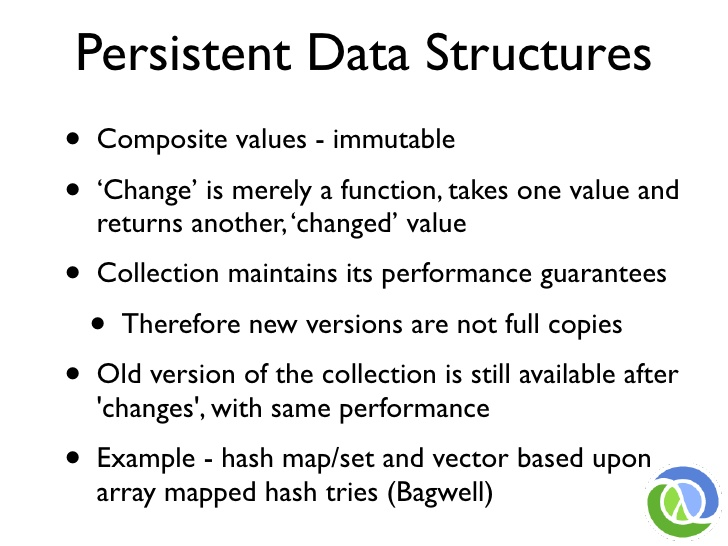

So there are two parts.  We are going to talk now about the values.
One of the things that people cringe at initially, if they have not
used functional programming languages before, is "that sounds
expensive".  If I have to copy the whole runner every time he moves
his foot, there is just no way I am going to do this.

And in particular, when you start talking about collections and things
like that, people get extremely paranoid.  Because what they know are
sort of the very bad collection class libraries they have, which
either have _no_ capabilities in this case, or some very primitive
things.  Sometimes there are copy-on-write collections, where every
time you write to it, the entire thing gets copied.

But there is a technology, which is not complicated, and it has a
fancy name.  It is called a persistent data structure.  That has
nothing to do with databases or disks.  But it is a way to efficiently
represent a composite object as a value, as an immutable thing, and to
make changes to that in an inexpensive way.

So change for one of these persistent data structures is really just
in quotes.  They do not change.  It is a function that takes an
existing instance of the collection or composite, and returns another
one that has the change enacted.

But there is a very particular meaning to Persistent Data Structures,
which is that, in order to make these changes, the data structure and
the change operation have to meet the performance guarantees you
expect from the collection.  So if it is a big O log N collection, or
a collection that has constant time access, or near constant time
access, those behavioral characteristics have to be met by this
changing operation.  It means you cannot conduct the change on
something that you expect to have log N behavior and copy the entire
thing, because copying the entire thing is linear behavior, right?  So
that is the critical thing.

The other critical aspect of persistent data structure is: sometimes
you will see libraries try to cheat.  They will make the very most
recent version this good immutable value, but on the way they ruin the
old version.  That also is not persistent.  That is another key aspect
of the word persistent.  In a persistent data structure, when you make
the new version, the old version is perfectly fine.  It is immutable.
It is intact.  It has the same performance guarantees.  It is not
decaying as you produce new values.

Every functional programming language tries to cheat this side, and
eventually says "forget this, we are going all immutable and we are
going to pay whatever the performance costs are, because the logical
cost of having old versions decay, or have some bizarre behavior
either from a multi-threading perspective or performance perspective,
is too high".  So what I am going to show you are legitimate
persistent collections where the old values have the same performance
characteristics.

And the particular example I am going to show you is the one that is
in Clojure.  It is derived from some work that Phil Bagwell did on
these ideal, he called him ideal hash tries.  And there are bit mapped
hash tries that have really good performance.  His versions were not
persistent, and so what I did for Clojure was I made them persistent.

[Time 0:26:57]

The secret to all persistent data structures is that they are tries.
There you go.  Now you know.  There are lots of different recipes and
I think people are very familiar with B-trees and red-black trees, or
maybe you know, Erlang uses some generalized balanced trees, I think,
which are interesting.  And there are trees that use randomization
techniques for balancing and other things.  These are different.  In
particular, they are different because they are tries with the `i`,
some people call them `tries` [rhymes with fries].  Tries [rhymes with
flees].

The idea behind that is that are not going to have a fixed path down
to a leaf.  You are going to use only as much of a path as you need to
produce a unique leaf position.  You usually see these things in
string search things, or maybe I think they are also used in Internet
routing tables and stuff like that.

Here the model is very simple.  We want -- at least I wanted for
Clojure -- something equivalent to a hash table.  I know I cannot sell
Clojure to Java programmers if it does not have something equivalent
to a hash table.  They do not want to hear about a red-black tree.
They known that it is OK, but it is not as good as the hash tables
they are used to.  They need something faster than that.  And these
are.

The way they work is that you hash the value you want to put into the
collection.  You end up with a 32 bit hash.  You are going to use the
first 5 bits of that hash to see if there is a unique position in the
first layer of your trie.  So effectively what is happening is you
have a 32-way branching going on in this trie.  In addition, there is
some fancy bit twiddling going on in each node so that those nodes are
sparse.  They are not fully populated, so you are not wasting the
space of not fully populated nodes.

You end up using a combination of population, bit pop, and some
algorithms you copy out of "Hacker's Delight".  Buy that.  Or you can
just use Clojure's.  In fact, Clojure's vectors, which is the same
kind of technology, has been ported to Factor and Scala already, which
is fine by me.

So if it is unique in the first 5 bits we are done.  We put it in the
first level of the trie.  If it is not, we are going to look at the
next 5 bits and walk down one more level to the trie, until we find
some unique position, and then we are done.  We are going to put the
value there.

The key thing about this is: how deep can this trie get?  So this one
is the root so, down one two three four five six if you had, whatever,
4 billion things.  So it branches extremely fast, and you can get a
million items in depth three.  It is very very shallow.  So the
combination of it being very shallow, and using this bit twiddling to
walk through the sparsely populated nodes in the intermediate levels,
makes it really fast.  So that is the representation, now we only need
to talk about: how do we make a changed version efficiently?

[Time 0:30:06]

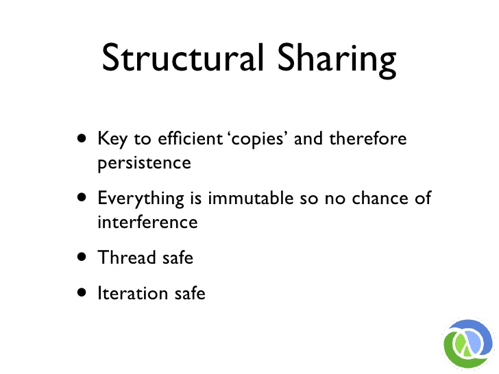

And the key there, as is true for all of these things, is structural
sharing.  All functional data structures are essentially recursively
defined, structurally recursively defined.  Which means that you can
make a new version that shares substantial structure with the version
you just had.  And that is the key to making efficient copies.  You
are not copying everything.  You are copying a very little bit.  I
will show you in a picture in a second how little a bit you use.

Since everything is immutable, sharing structure is no problem.
Nothing is going to change about the structure that you are sharing,
which means it is safe for multi-threaded use.  It is safe for
iteration.  You get none of this mutated while iterating nonsense.

[Time 0:30:48]

So how do we share structure?  We use a technology called path
copying.  Again, this is true for all trie data structures.  They all
work exactly the same way, which is: if we ignore the right hand path
here, that is the trie I showed you before.  It has 15 leaves.  We
want to add one under that red outlined purple guy at the bottom.  We
want to add a new node.  Add a 16th guy.

So what needs to happen is: we need to make a copy of that node,
obviously, because we are going to be giving him a new child.  A copy
of his parent.  And finally, the root.  This copy gets one additional
child, and the rest of the structure of the old version was shared.

So I said 3 levels could hold a million items, right?  32 times 32
times 32, did I get that right?  No, that is 32,000.  A lot.

[Audience laughter]

Well, 3 levels down.  If you count the root, it is 4 levels.  However
populated this last level was, making a new node here is only ever
going to copy 4 items.

How is that old tree?  Looking good, still fine.  We did not touch it.
And this is the path we need to copy to make the new one, which looks
like a new tree with this extra item.  If we are no longer referring
to that root, it will get garbage collected, as will the things it was
referring to that are no longer referenced.

So it is kind of basic, but I want to show it because a lot of people
just are not aware that this is a possible thing.  This is the kind of
data structure I think you should be using all the time unless you
have some emergency reason.  And that is why Clojure works this way.
All of the data structure work like this, by default.  You have to go
through extraordinary efforts to pick something else.

[Time 0:32:40]

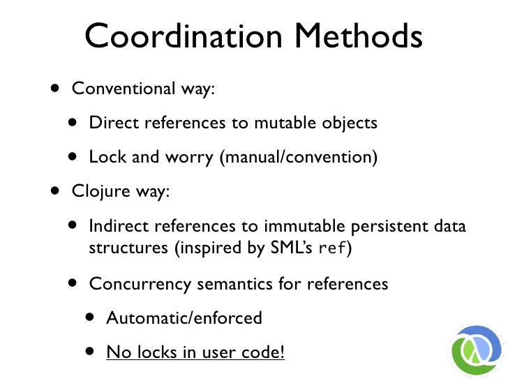

So that is the way to efficiently represent composite objects as
values.  We got one part of the problem solved.  Now we need to talk
about coordination methods.

The conventional way is not really a method.  The conventional way is:
it is your problem.  We saw in the Scala talk, there was a var.  It
did not have volatile semantics, but it happened to be the case that
the actors library in Java conducts some synchronization thing which
causes a happens-before, happens-after memory fence effect, in order
to make sure the contents of that var was valid in another thread.  In
your own program, that is going to be your worry.  It is nice that the
actors library takes care of vars in actors.  But vars in your program
otherwise are your problem.

And typically if we are trying to do composite objects we have to use
locks.  And everybody knows the problems with locks, I think.
Everybody know the problem with locks?  Everybody know the pain of
locks?  Locks are ...  Experts can build programs that work with
locks, but most people do not have the time or energy to do that well,
and maintaining it is really really difficult.  It is _extremely_
difficult.

So in Clojure what we are going to just do is just add a level of
indirection.  Instead of directly referring memory, those variables,
we are going to use indirection.  And then we are going to add
concurrency semantics to these references.  If you watched me talk
yesterday I said that, but I will show you some more details today.

[Time 0:34:05]

So this, quickly, is the picture of the current state of the world in
a lot of object-oriented languages.  You have a lot of references to
the same chunk of memory.  Basically it is a free for all.  They do
not know they are going to see a consistent object, that all the parts
are related to each other, that no one is twiddling with anything,
unless they can somehow stop the world.

But the core problem here now that we have lingo for it is: this
unifies identity and value, right?  The only place to put this value
for this identity is in the same piece of memory.  That is a problem.
We just looked at how to do new values.  It is great.  So what do we
need to do?  We need to create some new memory to represent that new
value.  If we say all values of foo have to end up in the same chunk
of memory space, we can never do a good job.  So that has a lot of
problems.

[Time 0:34:53]

How do you solve this?  You just use indirection.  It is the solution
to all computer science problems, right?  One level of indirection,
and now we have options.  Because this guy now can be immutable.  We
have separated the value, which is now immutable, and the identity,
which we are going to model with these little boxes.

Values never change.  If you want to see the current state of an
identity, you have to dereference it.  You have to say "give me your
state".  What you get out of that is a value that cannot change.  You
can spend all day looking at it, just like you can spend all day
looking at the photo to try to see if the runner was fouled.

I want to emphasize, if you think your object oriented programming
language's encapsulation techniques are a solution to this problem,
that is _not_ true.  If you have a variable or a field inside your
object and you write three methods that can change that field, and
people can call those methods from different threads, you have not
encapsulated _anything_ from a concurrency standpoint.  You have just
spread the problem and hid it behind something.

[Time 0:35:57]

So I am going to call those boxes references.  We have too many
overloaded terms.  I cannot think of any new words.  It is a reference
because it refers to something else.  So identities are references
that refer to their values.

But the critical thing is: in Clojure these are the only things that
you can mutate, unless you drop to Java and use Java stuff.  Of course
there are still classes and arrays and all that.  But if you want to
follow the Clojure model, you are going to have these references.
They are the only things that can change.  And what they do is just
manage time.  In other words, you can atomically move from one value
which is immutable, to another value which is immutable, and each of
the reference type provides different semantics for time.

So what are the characteristics of these semantics?  One of them is:
"Can other people see these changes I am making?  Is it shared?"
Because there is one way to manage time, which is the Star Trek
alternate universe model, where there is a bad Kirk in one universe
timeline, and a good Kirk in another, and they will never meet.  Of
course the problem with that is that occasionally they do meet.  But
one way is isolation.  So we will see the last model is isolation.
But in general most of these models are around making changes that
other parts of your program can see, so sharing.

The second part is synchronicity, and here we mean synchronicity in
the sense of now.  What now means to the caller.  In other words, from
a self-relative standpoint, is the change I am asking for going to
happen now, or at some other time, relative to me?  Is it independent?
And we are going to call those differences synchronous.  If it happens
now relative to me it is synchronous.  If it does not happen now
relative to me it is asynchronous.  It just happens at some point in
the future.  We cannot say exactly when.

[Time 0:37:50]

And the final characteristic of these references, where again you get
different choices and options, is whether or not the change is
coordinated.  I can be an independent runner and run all by myself,
and I am completely fine.  But a lot of times you need to move
something from one collection to another collection.  You do not ever
want it to be in both.  You do not ever want it to be in neither.
That requires coordination.  That is impossible to do with independent
autonomous entities.  You need coordination.

And it ends up that in the local case you can do coordination.
Distributing coordination like this is a fool's errand probably, but
people keep trying.  I do not think that there is ever going to be
distributed coherent coordinated change, but people are already
recognizing the fact that if you are willing to delay consistency, you
can sort of have coordination.  But in the local model, it is
perfectly possible to get coordinated change.

Otherwise, change is autonomous.  I change by myself.  I do not care
what you are doing, and no two of us can do something together.

So now we have these 3 characteristics.  Clojure has 4 types of
references that make different choices in these 3 areas.  Refs are
shared, people can see the changes, they are synchronous, they change
right now.  They change in a transaction, which means that you can
change more than one reference in the same transaction and those
changes will be coordinated.  Sort of the hardest problem is that
coordinated change problem.

Agents are autonomous.  They will feel a lot more like actors in an
actor model.  They are shared, people can see them.  They are
asynchronous, so you ask for a change, it is going to happen at some
point in the future, but you are going to immediately return.  And
they are autonomous.  There is no coordinating the activities of
agents.

[Time 0:39:42]

Atoms are shared.  People can see the changes.  They are synchronous.
They happen right now, so that is the difference between them and
agents.  And they are also autonomous.  You cannot change more than
one atom in a single unit of work.

And finally, Clojure has something called vars.  They isolate changes
with the good Kirk bad Kirk alternate universe model.  For any
identity there is a unique value in every thread.  You cannot possibly
see the changes in different threads.  I am not going to talk too much
about that, but it is kind of a special purpose construct derived from
Lisps.

[Time 0:40:17]

One of the things that is nice about the way these references work is:
they have a uniform state transition model.  All of them have
different functions that change the state, that say: move from one
state to another state.  And they use different names because they
have different semantics.  I do not want people to get all confused
about: is this happening synchronously or asynchronously, or do I need
a transaction?

But the model is always the same.  You are going to call one of the
changing functions.  You are going to pass the reference, the box, and
you are going to say, "Please use this function".  So you are going to
pass a function, maybe with these arguments, apply it to the current
state of the box, and use its return value as the new state.  So the
function will be passed the current state, under some constraints,
either atomically, within a transaction, some way.  It will be passed
the current state.  It can calculate a new state.  Again it is a pure
function you are passing.  That new state becomes the new value of the
reference.

In Clojure's references, you can always see the current state of a
reference by dereferencing it.  In other words, that is the local
visibility, because it is completely free to do.  And it yields much
more efficient programs, to be able to do that.  If you have to ask
for permission to see collections every time you want to see them, it
does not work in the local context.

In addition, one of the other shared attributes of these things is
that there is no user locking, you do not have any locking to do this
work, and none of these constructs can deadlock.

[Time 0:41:45]

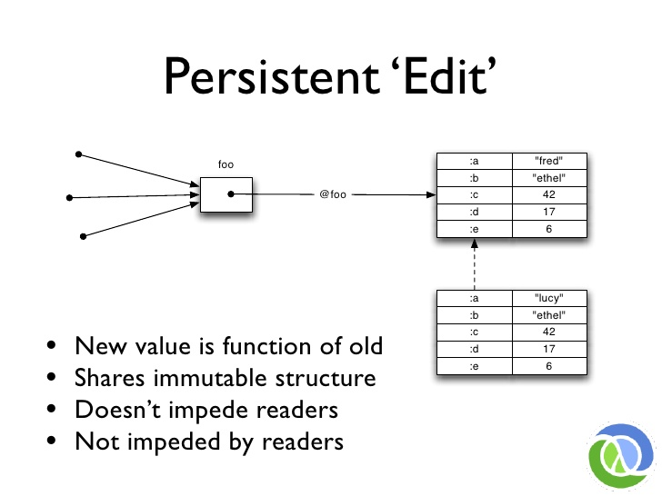

So what does it mean to edit something in this new world?  You are
going to have a reference to a value.  We can make a new value a la
carte, on the side.  We are going to call a function and create this
new value, which we intend to become the new state of foo.

The new values are a function of the old.  They can share structure.
We just saw that.  Doing this does not impede anybody who is reading
foo.  They are completely free to keep reading.  They do not have to
stop while we figure out the new version of foo.

In addition, it is not impeded by people reading.  We do not have to
wait for people to stop reading so we can start making a new version.
This is the kind of thing you are going to need for high-throughput
concurrency.

[Time 0:42:25]

And then going to a new state is just an atomic swapping of this box
to look at the new immutable value.  That is always coordinated.
There are always rules for how that happens.  I just showed you the
multiple semantics.  Any time somebody dereferences this after -- more
time words -- after this happens, they will see the new value.

Consumers are unaffected.  If I was looking at the old value, I do not
get disturbed by this happening.  I am just looking at an old value.
It is like I am looking at a picture of the runner to see.  I know the
race is over.  That is OK.  We _need_ to behave that way.

If you have been programming for so long as I have, it is really hard
to break from, "I own the world.  And I stop the world.  The world
goes when I say go."  We have to just break from that.  That is the
future.  We have to understand that we are going to be working with
data that is not necessarily the very latest data.  That is just the
future for us.

[Time 0:43:18]

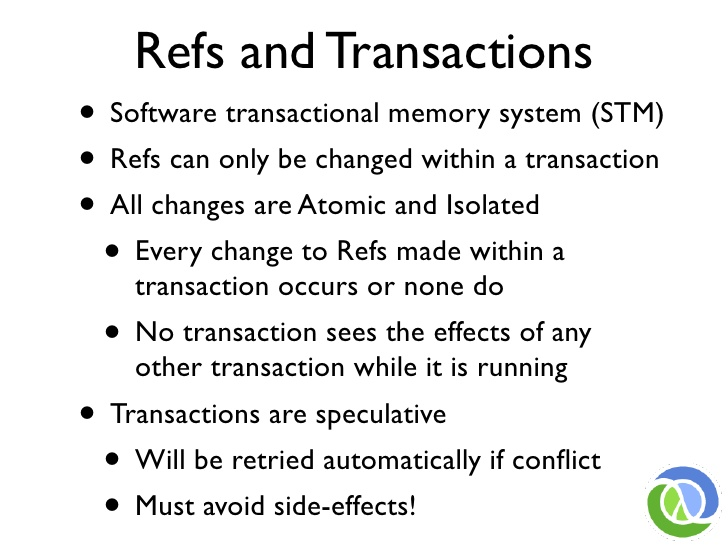

OK, so the hard reference, as I said, are the transactional ones.
Clojure has a software transactional memory system.  I almost hate
using this term because people like to criticize STM as if it was one
thing.  There are a whole bunch of different STMs.  They have
radically different characteristics.  Clojure's is radically different
from the other ones.

But they all share some things, which is basically a model that feels
a lot like a database model.  You can only change them within a
transaction.  All the changes you make to an entire set of references,
refs, inside a transaction, happen together, or none of them happen.
That is atomicity.  You do not see the effects of any other
transactions while you are running.  They do not see your effects.  It
is the normal things.

The one unique thing about STM transactions is that they are
speculative.  You may not win.  Somebody else may win.  You will
automatically retry up to a certain limit, which means that your
transactions cannot contain side effects.

[Time 0:44:15]

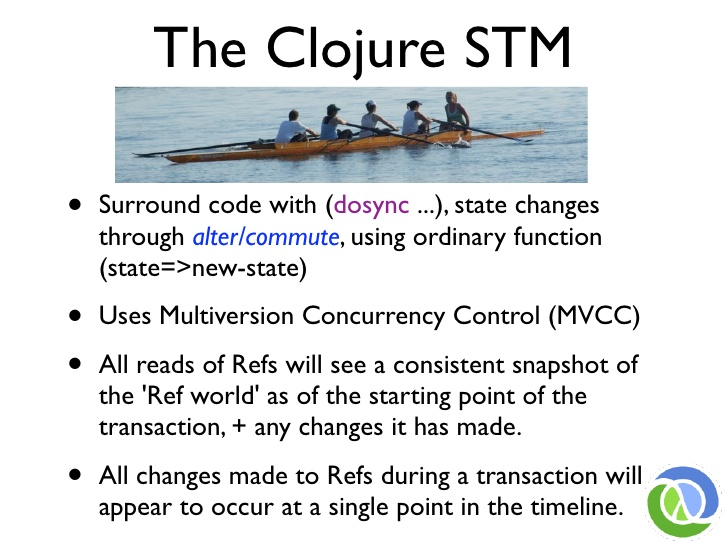

This is the way you do coordination.  You cannot really do
coordination without some technique like this.  You cannot build a
system on independent entities and do this kind of work.

So in practice what do you do?  You just wrap your code with `dosync`,
which just means this is a transaction.  There are two functions alter
and commute, which work like I described.  They take a reference and a
function and some args and say, "apply this to the reference in the
transaction and make the return value the new state."

Internally Clojure uses multiversion concurrency control (MVCC) which
I also think is a very critical component to doing STM in a way that
is going to work in the real world.  A lot of STM designs are: you
just write your app in the terrible way you were, with your object
oriented language, banging on fields, and STM is magically going to
make that better.

I do not believe in that at all.  Clojure's STM is not designed for
that kind of work.  If you make every part of your object a ref, it is
not going to work and I am not going to feel bad for you, because I
just explained how to do it.  You make your object the value and
atomically switch that value, and everything is better.

But you do have this issue of, again, people would criticize STMs
universally, because _most_ STMs do something called "read tracking".
In order to make sure that nothing bad happened while your transaction
was going on, they track every _read_ that you do, in addition to all
the writes that you do.  I also believe that that is not going to
work.  So Clojure does no read tracking.

The way it accomplishes that is with a technique called Multiversion
Concurrency Control, which is the way Oracle and PostgreSQL work as
databases, where essentially old values can be kept around in order to
provide a snapshot of the world for transactions, while other
transactions that are writing can continue.  That ends up being
extremely effective.

But it falls out of this necessity to be using references to _values_.
It has got to be cheap for me to keep an old value around for you.  I
just showed you how it is cheap, if you are using persistent data
structures.  All these things go together.  If you do not do all of
this stuff together, you do not have an answer to this problem, in my
opinion.  But when you do this, it is really nice.  So MVCC STM does
not do read tracking.

[Time 0:46:24]

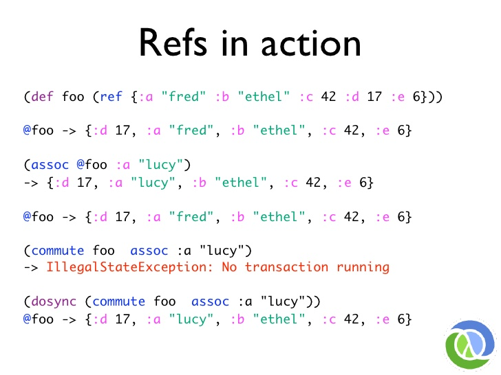

So what does it looks like in practice?  We define foo to be a ref.
That is a transactional box to that map.  We can dereference foo, and
we see what is in there.  Unfortunately the name order changes because
they are hash maps, so they do not guarantee any order of iteration.

We can go and manipulate the value inside foo.  We can say, "give me
the map that is inside foo, and associate the `a` key with `lucy`".
That returns a new value.  Nothing about that impacted the reference.
I took the value out.  I made another value.  We can do all kinds of
calculations completely outside of the transactional system.  It is
still a functional programming language.  Get the value out and write
functional programs.  So that did not have any effect on foo.

We can go and we can use that `commute` function, which actually says:
take a reference, commute a reference with a function `assoc`, which
adds a value to a map, the key `a` and the value `lucy`.  And that
fails, because there is a semantics to those refs which is that you
can only do this for refs inside a transaction.  So you get an error.

If however you put that same work inside a transaction, it succeeds.
And when the transaction is complete, that is the value of foo.

[Time 0:47:40]

I do not have a lot of time to talk about the implementation details.
But again, do not think that STM is one thing.  If you have read one
paper on STM, you know nothing about STM.  If you have read all the
papers about STM, you know a little bit more than nothing about STM.
None of us knows anything about STM.  This is still a research topic.

But I do know this: this works, and it works really well, and it makes
it easy to write programs that do not use locks.  I think all the
programs that I have written in my career, I could have used this any
time I needed coordinated change, and it would have been fine.  People
can bang on it and try to push the scalability issues and whatnot.
From a correctness standpoint, this is a godsend.

However, inside, unlike some STMs, Clojure's STM is not spinning
optimistic.  It does use locks.  It uses wait notify, it does not
churn.  Processes will wait for other processes.  It has got deadlock
detection.  It has got age-based barging.  There is extreme minimum --
in fact, I think what is actually the minimum amount -- of sharing in
a transactional system, which is one CAS, which is for the timestamps.

People have demonstrated you can hammer on one CAS continuously with
80 threads, and that is about the limit of scalability.  But when you
actually have some work in your transactions, it is no problem.  I
have run stuff on an Azul box with 600 cores, and that CAS is not
going to be the problem.

As I said there is no read tracking.  It is important that this STM is
designed for coarse-grained orientation.  It is not one of these
snake-oil STMs that you can do what you were doing.  You have to do
this new thing.  You have to use references to immutable values, then
you can use my STM.  It is not going to make your old programs good.

And readers do not then get impeded by writers, and vice versa.  It
also supports commute, which I do not really have time to explain
right now.

[Time 0:49:33]

I do want to show you one other model, because it is very different,
And it is nice in that it is very different, yet very much the same.
Because we have sort of isolated change from values, you can take a
completely different approach to time.

So in an agent, which is another kind of these reference cells, each
agent is completely independent.  They have their own state and they
cannot be coordinated with any other.  State change is through
actions, which are essentially just ordinary functions that you are
going to send to the agent with a function called `send` or
`send-off`.  That function is going to return immediately.  You are
going to send this function and some data, say, "at some point in the
future, apply this function to the current value of the agent with
these arguments, and make the return value of the function the new
state of the agent."

That happens asynchronously on a thread from a thread-pool.  Only one
action per agent happens at a time, so agents essentially have sort of
an input mailbox queue.  So they also do all of their work serially.
This is another promise of the semantics of an agent.

[Time 0:50:38]

Again as with the other reference types, you can just dereference it
and see what is in there.  If you do successive actions to agents
inside the same action, they are held until the action completes, so
they can see the new state.

The agents do coordinate with transactions, which is kind of nice.  So
one of the problems is you saw, "no side effects in transactions".  So
you are wondering, how do I let somebody know I completed this
transaction successfully?  Do I need to send them a message, or do
something side effect-y?  It ends up that if you send an agent action
during a transaction, that is held until the transaction commits.  So
if the transaction gets retried, those messages do not go out until
the transaction actually succeeds.  So that coordination is a really
nice feature.  These two things work together.

They are not quite actors.  The difference with an actor model is:
that is a distributed model.  You do not have direct access to the
state in an actor model, because you cannot distribute that.  Since I
am not doing distribution, I can let you access the state directly,
which means it is a suitable place to put something that you actually
may need to share a lot, without necessarily serializing activity.

[Time 0:51:40]

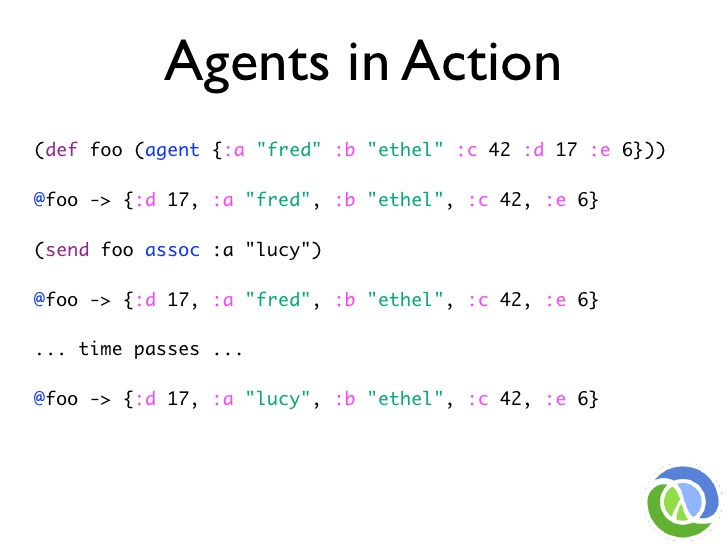

So what does this look like to use?  I say `def foo` to be an `agent`
referring to a map.  I dereference it.  I see the contents of the map.
I send that reference the same function `associate` `:a` with `lucy`.
I look at it right away.  It may not be there yet.  Some amount of
time will pass.  I cannot promise you what.  And then it will be
different.

This is a different way of thinking about things, but people who
program in Erlang completely do amazing things with thinking about
things this way.  Things can be asynchronous.  You cannot keep
programming your computer as if it was your old Apple and there was
only you and your assembly language and you were king of the universe.
Things happen at the same time now.

[Time 0:52:27]

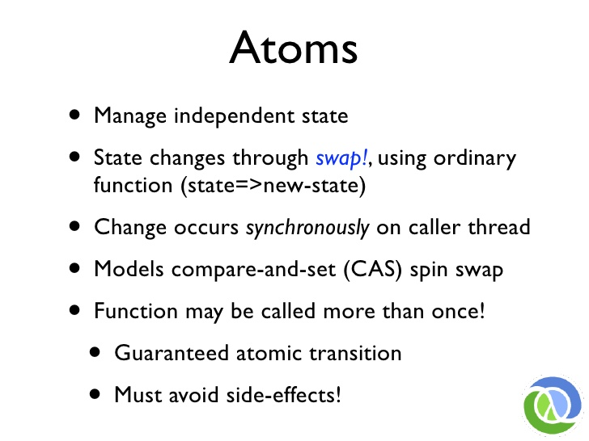

Atoms, a very similar story to agents.  They are independent.  You
cannot coordinate change to atoms.  There is a different name for the
state change function.  It is called `swap`.  Again it takes an
ordinary function of the old state to the new state.  The change
happens _synchronously_ now, so that is the difference between atoms
and agents.  It happens right now.

This is a model for compare and swap.  Compare and swap, or compare
and set, is a primitive that is going to let you look at a piece of
compare and set memory and say, "I want it to turn in to this."  And
it will turn into this only if it is still that.  So you look at it.
You see it is that.  You want to turn it into this.  If it is still
that, inside atomically it will say, OK I will make it this.

The problem with CAS by itself is: you usually want to read the value,
do something with it, and then put it back.  So you get this interval
between when you looked at it, and when you try to do the CAS.  And of
course when you do that, and somebody else has done something, that
CAS is going to fail.  And then what do you do?  Typically, a well
written CAS thing, where CAS is a suitable data structure, will have a
little spin loop.  You are going to spin in a value into a CAS.  Atoms
do the spinning for you.  As a result, the function may be called more
than once.

Again, we are in this world where you should be programming with these
side effect free functions, because they need to be called more than
once, both in transactions and in atoms.  So you have to avoid side
effects, but the value you get out of this is that when you succeed,
you know the function you applied was applied to the value the
function was passed, and the result that got put in had no intervening
activity occur on that atom.  That is a powerful construct you need to
have.

[Time 0:54:08]

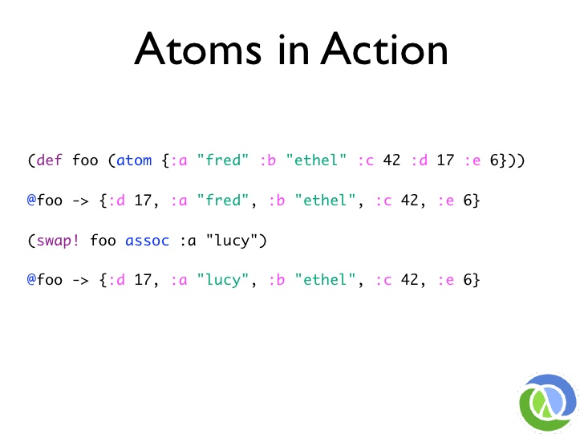

And look at these.  It looks a lot like the other ones.  Define `foo`
to be an `atom` that refers to that map.  Dereference it, it is there.
We swap.  Immediately we get the new value.

[Time 0:54:22]

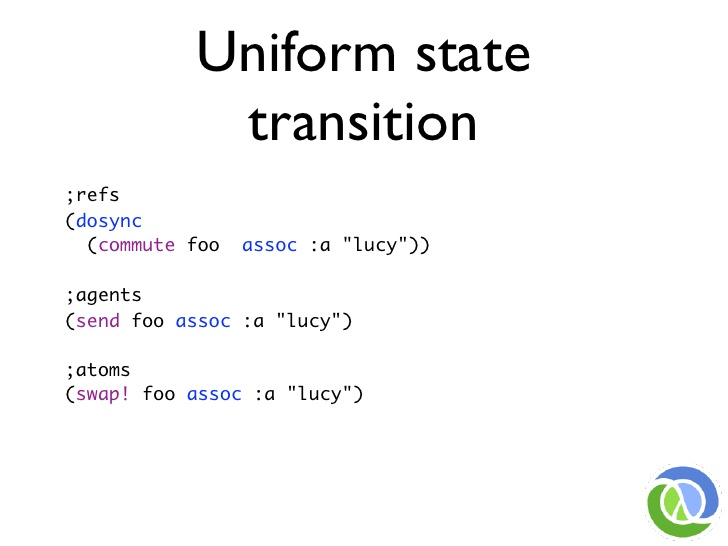

So this is the uniform state transition model.  That is what refs look
like.  Start a transaction, commute or alter.  Your ref, passing a
function and some arguments.  The result of the function is your new
value.

Agents, same thing, except completely different time semantics.  It
happens asynchronously in a thread-pool, some time later.  You return
immediately.

Atoms, happen right now, but are independent from the others.

You need all of these things to write a real multi-threaded program,
especially in the local model.  These are all things that I have
needed to do in my career writing concurrent programs in the local
part of the program, and I do not think you can do without them.  So
here they are, but it is a uniform way to go.

[Time 0:54:57]

So, in summary, immutable values are critical for functional
programming.  But it ends up they are also critical for state.  We
cannot really manage time and state without immutable values.  If you
you are going to let two things change, time and value, you cannot do
anything that is reliable.

Persistent data structures let you represent composite objects
efficiently, immutably.  Once you are able to accept this constraint
of immutability on your values, you have all of these options.  I am
working on a fifth reference type with slightly different semantics.
It is easy to do, because I have separated time management from value
management.

Finally, I think this is pretty easy to use.  If you have seen some
other models, this is a lot like variables that work.

[Time 0:55:51]

So, thank you!

[Time 0:55:52]
